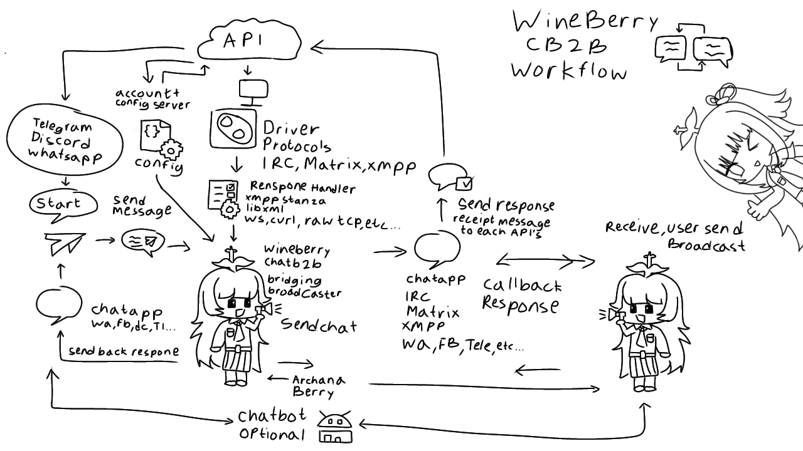

# Wineberry Chat B2B

**Wineberry Chat B2B** is a modular, multi-protocol chat backend designed for real-time communication between clients using IRC, Matrix, or XMPP protocols. It provides a unified interface (`driver.h`) to interact with each protocol's core functionalities, abstracting complex protocol operations under a consistent API.

---

## Features

- **IRC Client Support** (RFC-compliant)
- **Matrix Client Support** (via REST API and WebSocket sync)
- **XMPP Client Support** (with SASL, XML streaming, and stanza handling)
- **Unified B2B Driver Layer** for multi-protocol abstraction
- **Lightweight & Testable**: minimal dependencies, simple C codebase

---



---

## Directory Structure

```

project-root/
├── include/berry/               # Public headers for each protocol
│   ├── b2b/                     # Unified abstraction layer
│   ├── irc/                     # IRC client logic and utilities
│   ├── matrix/                  # Matrix client implementation
│   └── xmpp/                    # XMPP protocol layer
├── source/berry/               # Implementation of each protocol
│   ├── b2b/
│   ├── irc/
│   ├── matrix/
│   └── xmpp/
├── test/                       # Protocol test cases and configs
├── Makefile                    # Build instructions
└── README.md                   # This file

````

---

## Protocol Modules

### IRC Module

- `irc_driver.h/c`: Public API – `connect()`, `send()`, `recv()`
- `irc_client.h/c`: Socket and I/O event handling
- `irc_parser.h/c`: Raw message parsing (lines, commands)
- `irc_utils.h/c`: Helper functions (PING/PONG, string ops)

### Matrix Module

- `matrix_driver.h/c`: Public API – `login()`, `send()`, `sync()`
- `matrix_api.h/c`: REST API endpoint helpers
- `matrix_ws.h/c`: WebSocket sync interface
- `matrix_utils.h/c`: JSON helpers, token management

### XMPP Module

- `xmpp_driver.h/c`: Public API – `connect()`, `auth()`, `send()`
- `xmpp_stream.h/c`: XML stream setup, parsing
- `xmpp_sasl.h/c`: SASL authentication (PLAIN, SCRAM)
- `xmpp_stanza.h/c`: Stanza building/parsing
- `xmpp_utils.h/c`: DNS SRV, TLS setup

### B2B Abstraction Layer

- `b2b_driver.h/c`: Common interface to bridge multiple chat protocols (WIP / customizable for routing logic)

---

## Building

```bash
make
````

This will compile all protocol drivers and test binaries.

---

## Testing

Test files are available under the `test/` directory. Each test reads from a corresponding JSON config:

* `test_irc.c` → `config_irc.json`
* `test_matrix.c` → `config_matrix.json`
* `test_xmpp.c` → `config_xmpp.json`

To run a test manually:

```bash
./test/test_irc
```

---

## License

This project is part of the **Archana Berry** ecosystem [APBL - Archana Berry Public License](https://github.com/archanaberry/Lisensi). Licensing terms may vary — see project root or community guidelines for details.

---

## Contribution

Contributions are welcome! Feel free to fork and submit pull requests. Ensure your code is well-documented and tested against all supported protocols.

```
